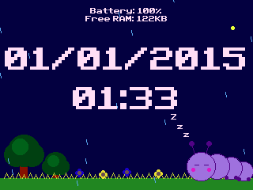

# Clock Plus CE

A dynamic screensaver written for the Ti-84 Plus CE to show the time and calculator stats.

## Build

- Install the [CE C/C++ Toolchain](https://ce-programming.github.io/toolchain/index.html)
- Download [libload](https://github.com/CE-Programming/libload) and 
- Run `make` (the program is `CLOCK.8xp`)
